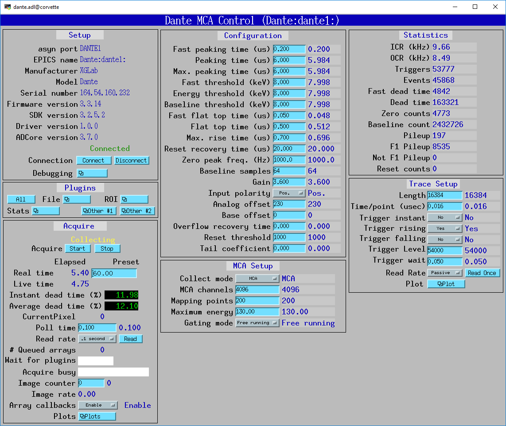
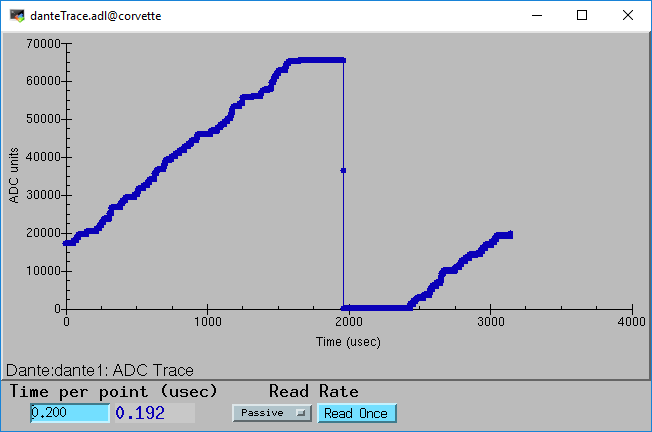

======================================
Dante
======================================

:author: Mark Rivers, University of Chicago

.. contents:: Contents

.. _dante:             https://github.com/epics-modules/dante
.. _mca:               https://github.com/epics-modules/mca
.. _asyn:              https://github.com/epics-modules/asyn
.. _asynNDArrayDriver: https://areadetector.github.io/master/ADCore/NDArray.html#asynndarraydriver
.. _areaDetector:      https://areadetector.github.io
.. _XGLab:             https://www.xglab.it

Overview
--------

This is an EPICS driver for the XGLab_ Dante digital x-ray spectroscopy system.
The Dante is available in single channel and 8-channel versions
This module is intended to work with either, though it has currently only been tested on the single-channel version.
In this document NumBoards refers to the number of input channels, e.g 1 for a single-channel Dante and 8 for an 
8-channel Dante.

The Dante can collect data in 3 different modes:

- Single MCA spectrum.  It acquires a single MCA spectrum on all channels.
- MCA mapping mode.  It acquires multiple spectra in rapid succession, and it often used for making an x-ray map where there is an MCA
  spectrum for each channel at each pixel.  The advance to the next pixel can come from an internal clock or an external trigger.
- List mapping mode.  It acquires each x-ray event energy and timestamp in a list buffer.

The Dante driver is derived from the base class asynNDArrayDriver_, which is part of the EPICS areaDetector_ package.
The allows the Dante driver to use all of the areaDetector plugins for file saving in MCA mapping and list modes,
and for other purposes. It also implements the mca interface from the EPICS mca_ module.
The EPICS mca record can be used to display the spectra and control the basic operation including Regions-of-Interest (ROIs).

The Dante driver can be used on both Windows and Linux. A Windows machine with a USB interface is currently required
to load new firmware.  Otherwise the module can be used from either Linux or Windows over Ethernet. Currently XGLab only
provides the Linux library built with the version of gcc on Ubuntu 18.  This means it cannot be used on RHEL7 or Centos7, for
example.  However, they are planning to release a build done with an older compiler that with run on RHEL7/Centos7 soon.

General controls
----------------
These are the records for general control of the system.

.. cssclass:: table-bordered table-striped table-hover
.. list-table::
   :header-rows: 1
   :widths: auto

   * - EPICS record names
     - Record types
     - drvInfo string
     - Description
   * - CollectMode, CollectMode_RBV
     - mbbo, mbbi
     - DanteCollectMode
     - Controls the data collection mode.
       Choices are "MCA" (0), "MCA Mapping" (1) and "List" (2).
   * - GatingMode, GatingMode_RBV
     - mbbo, mbbi
     - DanteGatingMode
     - Controls the gating mode.
       Choices are "Free running" (0), "Trig rising" (1), "Trig falling" (2), "Trig both" (3), "Gate high" (4), "Gate low" (5).
   * - MaxEnergy, MaxEnergy_RBV
     - ao, ai
     - DanteMaxEnergy
     - The actual energy of the last channel.  The user must provide this value based on the energy calibration.
       It is used to provide meaningful units for FastThreshold, EnergyThreshold, and BaselineThreshold.
   * - PollTime, PollTime_RBV
     - ao, ai
     - DantePollTime
     - The time between polls when reading completion status, MCA mapping data, and list mode data from the driver.
       0.01 second is a reasonable value that will provide good response and resource utilization.

Configuration parameters
------------------------
These records control the configuration of the digital signal processing. The readback (_RBV) values may differ slightly
from the output values because of the discrete nature of the system clocks and MCA bins.

.. cssclass:: table-bordered table-striped table-hover
.. list-table::
   :header-rows: 1
   :widths: auto

   * - EPICS record names
     - Record types
     - drvInfo string
     - Description
   * - InputPolarity, InputPolarity_RBV
     - bo, bi
     - DanteInvertedInput
     - The pre-amp output polarity. Choices are "Pos." (0) and "Neg." (1).
   * - AnalogOffset, AnalogOffset_RBV
     - longout, longin
     - DanteAnalogOffset
     - The analog offset applied to the input signal, 0 to 255. 
       This offset must be adjusted to keep the input signal within the range of the ADC.
       This should be adjusted using the ADC Trace plot with a long sampling to see the range of the input
       signal through a reset event.
   * - ResetThreshold, ResetThreshold_RBV
     - longout, longin
     - DanteResetThreshold
     - The reset threshold in ADC units per N 8 ns (?) sample intervals. The Dante detects a reset the signal changes by more than this amount. 
       The standard firmware uses N=6 and this ResetThreshold value.
       The high-rate firmware uses N=1 and fixes ResetThreshold=256, so this parameter has no effect.
   * - ResetRecoveryTime, ResetRecoveryTime_RBV
     - ao, ai
     - DanteResetRecoveryTime
     - The time in microseconds to wait after a reset event.
   * - Gain, Gain_RBV
     - ao, ai
     - DanteGain
     - The gain which controls the number of ADC units per MCA bin.  Gains of 1.0-4.0 are typical.
   * - FastThreshold, FastThreshold_RBV
     - ao, ai
     - DanteFastFilterThreshold
     - The fast filter threshold in keV.
   * - FastPeakingTime, FastPeakingTime_RBV
     - ao, ai
     - DanteEdgePeakingTime
     - The peaking time of the fast filter in microseconds.
   * - FastFlatTopTime, FastFlatTopTime_RBV
     - ao, ai
     - DanteEdgeFlatTop
     - The flat top time of the fast filter in microseconds.
   * - EnergyThreshold, EnergyThreshold_RBV
     - ao, ai
     - DanteEnergyFilterThreshold
     - The energy filter threshold in keV.
   * - PeakingTime, PeakingTime_RBV
     - ao, ai
     - DantePeakingTime
     - The peaking time of the slow filter in microseconds.
   * - MaxPeakingTime, MaxPeakingTime_RBV
     - ao, ai
     - DanteMaxPeakingTime
     - The maximum peaking time of the slow filter in microseconds. Used only with the high-rate firmware.
       Must be set to 0 when using the standard firmware.
   * - FlatTopTime, FlatTopTime_RBV
     - ao, ai
     - DanteFlatTop
     - The flat top time of the slow filter in microseconds.
   * - BaselineThreshold, BaselineThreshold_RBV
     - ao, ai
     - DanteEnergyBaselineThreshold
     - The baseline filter threshold in keV.
   * - MaxRiseTime, MaxRiseTime_RBV
     - ao, ai
     - DanteMaxRiseTime
     - The maximum rise time in usec. Pulses with a longer rise time will be pileup rejected.
   * - ZeroPeakFreq, ZeroPeakFreq_RBV
     - ao, ai
     - DanteZeroPeakFreq
     - The frequency of the zero-energy peak in Hz.
   * - BaselineSamples, BaselineSamples_RBV
     - longout, longin
     - DanteBaselineSamples
     - The number of baseline samples.  Typical value is 64.
   * - TimeConstant, TimeConstant_RBV
     - ao, ai
     - DanteTimeConstant
     - The time constant. NOT SURE WHAT THIS DOES.
   * - TailCoefficient, TailCoefficient_RBV
     - ao, ai
     - DanteTailCoefficient
     - The tail coefficient. NOT SURE WHAT THIS DOES.
   * - BaseOffset, BaseOffset_RBV
     - longout, longin
     - DanteBaseOffset
     - The base offset. NOT SURE WHAT THIS DOES.
   * - OverflowRecoveryTime, OverflowRecoveryTime_RBV
     - ao, ai
     - DanteOverflowRecoveryTime
     - The overflow recovery time. NOT SURE WHAT THIS DOES.

Run-time statistics
-------------------
These are the records for run-time statistics.

.. cssclass:: table-bordered table-striped table-hover
.. list-table::
   :header-rows: 1
   :widths: auto

   * - EPICS record names
     - Record types
     - drvInfo string
     - Description
   * - InputCountRate
     - ai
     - DanteInputCountRate
     - The input count rate in kHz.
   * - OutputCountRate
     - ai
     - DanteOutputCountRate
     - The output count rate in kHz.
   * - Triggers
     - longin
     - DanteTriggers
     - The number of triggers received.
   * - Events
     - longin
     - DanteEvents
     - The number of events received.
   * - FastDeadTime
     - longin
     - DanteEdgeDTime
     - The fast deadtime in clock ticks.
   * - DeadTime
     - longin
     - DanteFilt1DT
     - The filter 1 deadtime in clock ticks.
   * - ZeroCounts
     - longin
     - DanteZeroCounts
     - The number of zero count events.
   * - BaselineCount
     - longin
     - DanteBaselinesValue
     - The number of baseline events.
   * - PileUp
     - longin
     - DantePUPValue
     - The number of pileup events.
   * - F1PileUp
     - longin
     - DantePUPF1Value
     - The number of filter 1 pileup events.
   * - NotF1PileUp
     - longin
     - DantePUPNotF1Value
     - The number of not filter 1 pileup events.
   * - ResetCounts
     - longin
     - DanteResetCounterValue
     - The number of reset events.
   * - LastTimeStamp
     - ai
     - DanteLastTimeStamp
     - The last timestamp time in clock ticks.
 

MCA mapping mode
----------------
These are the records for MCA Mapping mode.

.. cssclass:: table-bordered table-striped table-hover
.. list-table::
   :header-rows: 1
   :widths: auto

   * - EPICS record names
     - Record types
     - drvInfo string
     - Description
   * - MappingPoints, MappingPoints_RBV
     - longout, longin
     - DanteMappingPoints
     - The number of spectra to collect in MCA mapping mode.
   * - CurrentPixel
     - longin
     - DanteCurrentPixel
     - The current pixel number in MCA mapping mode.
     
In MCA mapping mode the GatingMode can be "Free running", "Trig rising", "Trig falling", or "Trig both".
In free-running mode the Dante will begin the next spectrum when the PresetReal time has elapsed.
In triggered mode the Dante will begin the next spectrum when the when a trigger occurs 
or when the PresetReal time has elapsed, whichever comes first.
To advance only on trigger events set the PresetReal time to a value larger than the maximum time between triggers.

The MCA spectra are copied into NDArrays of dimensions [NumMCAChannels, NumBoards]. For a 1-channel Dante
NumBoards is 1.  The run-time statistics for each spectrum are copied into NDAttributes attached to each
NDArray. The attribute names contain the board number, for example "RealTime_0".

The NDArrays can be used by any of the standard areaDetector plugins.  For example, they can be streamed
to HDF5, netCDF, or TIFF files.

List mode
---------
These are the records for list mode.

.. cssclass:: table-bordered table-striped table-hover
.. list-table::
   :header-rows: 1
   :widths: auto

   * - EPICS record names
     - Record types
     - drvInfo string
     - Description
   * - ListBufferSize, ListBufferSize_RBV
     - longout, longin
     - DanteListBufferSize
     - The number of x-ray events per buffer in list mode. 
       Once this number of events has been received the events read from the Dante
       stored in NDArrays, and callbacks are done to any registered plugins.
   * - CurrentPixel
     - longin
     - DanteCurrentPixel
     - The total number of x-ray events received so far.

List mode events are 64-bit unsigned integers.

- Bits 0 to 15 are the x-ray energy, i.e. ADC value.
- Bits 16 to 19 are the filter that detected this event.  These bits are not used in high-rate firmware.
- Bits 20 to 63 are the timestamp in 32 ns units.

In list mode the x-ray events are copied into NDArrays.
Because the EPICS asyn and areaDetector modules do not yet support 64-bit integers the data type of
the NDArrays is set to NDUInt8, and the NDArrayDimensions are [ListBufferSize*8, NumBoards].
For a 1-channel Dante NumBoards is 1.

The run-time statistics for ListBufferSize events are copied into NDAttributes attached to each
NDArray. The attribute names contain the board number, for example "RealTime_0".
Note that these statistics are cummulative for the entire acquisition, not just since the
last time the event buffer was read.
By making ListBufferSize smaller one obtains a more frequent sampling of these statistics.

These statistics also update the run-time statistics records described above, so there is feedback
while the list mode acquisition is in progress.

The first NumMCAChannels events are copied to the buffer for the MCA record for each board.
In this case the MCA record will not contain an x-ray spectrum, but rather will contain the x-ray
energy in ADC units on the vertical axis and the event number on the horizontal axis.

The NDArrays can be used by any of the standard areaDetector plugins.  For example, they can be streamed
to HDF5, netCDF, or TIFF files.

Note that the datatype in the files is unsigned 8-bit integers.  Applications that read the arrays must
cast them to unsigned 64-bit arrays before operating on them.
In the future support for 64-bit integers will be added to asyn and areaDetector, and the NDArrays will
have the correct new NDUInt64 datatype.

IOC startup script
------------------
The command to configure an ADSpinnaker camera in the startup script is::

  ADSpinnakerConfig(const char *portName, const char *cameraId, int traceMask, int memoryChannel,
                    size_t maxMemory, int priority, int stackSize)

``portName`` is the name for the ADSpinnaker port driver

``cameraId`` is the either the serial number of the camera or the camera index number in the system.  The serial number is normally printed
on the camera, and it is also the last part of the camera name returned by arv-tool, for example for
``"Point Grey Research-Blackfly S BFS-PGE-50S5C-18585624"``, it would be 18585624. 
If cameraId is less than 1000 it is assumed to be the system index number, if 1000 or greater it is assumed to be a serial number.

``traceMask`` is the initial value of asynTraceMask to be used for debugging problems in the constructor.

``memoryChannel`` is the internal channel number in the camera to be used for saved cameras settings.

``maxMemory`` is the maximum amount of memory the NDArrayPool is allowed to allocate.  0 means unlimited.

``priority`` is the priority of the port thread.  0 means medium priority.

``stackSize`` is the stack size.  0 means medium size.

MEDM screens
------------
The following is the main MEDM screen dante.adl.

The following is the MEDM screen mca.adl displaying the mca spectrum as it is acquiring.

.. figure:: dante_mca.png
    :align: center

The following is the MEDM screen danteTrace.adl displaying the ADC trace. One reset is visible on this trace.

The following is the MEDM screen NDFileHDF5.adl when the Dante is saving MCA mapping data to an HDF5 file.

.. figure:: dante_mapping_hdf5.png
    :align: center

