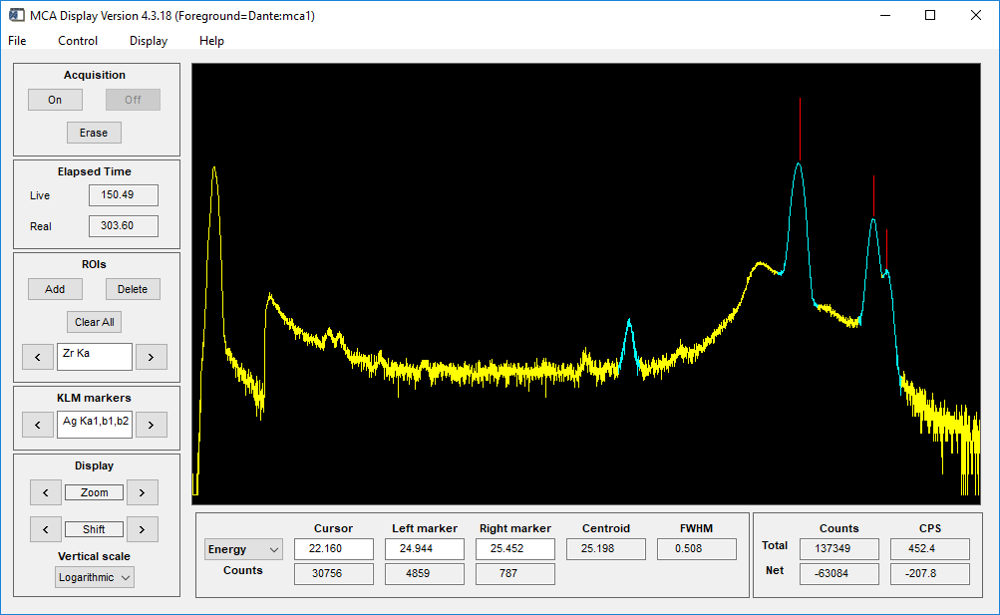
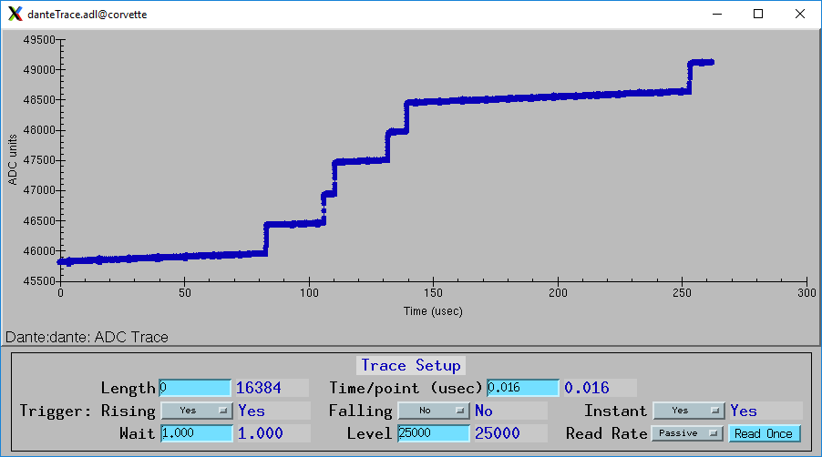

=====
Dante
=====

:author: Mark Rivers, University of Chicago

.. contents:: Contents

.. _dante:             https://github.com/epics-modules/dante
.. _mca:               https://github.com/epics-modules/mca
.. _asyn:              https://github.com/epics-modules/asyn
.. _asynNDArrayDriver: https://areadetector.github.io/master/ADCore/NDArray.html#asynndarraydriver
.. _areaDetector:      https://areadetector.github.io
.. _XGLab:             https://www.xglab.it
.. _read_nd_hdf5:      https://github.com/CARS-UChicago/IDL_Detectors/blob/master/read_nd_hdf5.pro

Overview
--------

This is an EPICS driver for the XGLab_ Dante digital x-ray spectroscopy system.
The source code is in the dante_ repository in the Github epics-modules project.
The Dante is available in single channel (Dante1) and 8-channel (Dante8) versions.
This module is intended to work with either, though it has currently only been tested on the single-channel version.
In this document NumBoards refers to the number of enabled input channels, e.g. 1 for a Dante1, up to 8 for a 
Dante8, and >8 for systems with more than one Dante8 daisy-chained together.  
If a channel is disabled then it is not counted in NumBoards.

The Dante can collect data in 3 different modes:

- Single MCA spectrum.  It acquires a single MCA spectrum on all channels.
- MCA mapping mode.  It acquires multiple spectra in rapid succession, and it often used for making an x-ray map where there is an MCA
  spectrum for each channel at each pixel.  The advance to the next pixel can come from an internal clock or an external trigger.
- List mapping mode.  It acquires each x-ray event energy and timestamp in a list buffer.

The Dante driver is derived from the base class asynNDArrayDriver_, which is part of the EPICS areaDetector_ package.
The allows the Dante driver to use all of the areaDetector plugins for file saving in MCA mapping and list modes,
and for other purposes. It also implements the mca interface from the EPICS mca_ module.
The EPICS mca record can be used to display the spectra and control the basic operation including Regions-of-Interest (ROIs).

The Dante driver can be used on both Windows and Linux. A Windows machine with a USB interface is required
to load new firmware.  Otherwise the module can be used from either Linux or Windows over Ethernet. The Linux library
provided can run on most Linux versions, including RHEL7/Centos7.

This document does not attempt to give an explanation of the principles of operation of the Dante, or a detailed explanation
of the many configuration parameters for the digital pulse processing.  The user should consult the
:download:`DanteManual <DANTE-4553 Manual rev2.3.pdf>` for this information.

System controls
---------------
These records are in the file ``dante.template``. This database is loaded once for the Dante system.  It provides
control of the system-wide settings for the system.

.. cssclass:: table-bordered table-striped table-hover
.. list-table::
   :header-rows: 1
   :widths: auto

   * - EPICS record names
     - Record types
     - drvInfo string
     - Description
   * - CollectMode, CollectMode_RBV
     - mbbo, mbbi
     - DanteCollectMode
     - Controls the data collection mode.
       Choices are "MCA" (0), "MCA Mapping" (1) and "List" (2).
   * - GatingMode, GatingMode_RBV
     - mbbo, mbbi
     - DanteGatingMode
     - Controls the gating mode.
       Choices are "Free running" (0), "Trig rising" (1), "Trig falling" (2), "Trig both" (3), "Gate high" (4), "Gate low" (5).
   * - NumMCAChannels, NumMCAChannels_RBV
     - mbbo, mbbi
     - MCA_NUM_CHANNELS
     - The number of MCA channels to use.  Choices are 1024, 2048, 4096.
   * - PollTime, PollTime_RBV
     - ao, ai
     - DantePollTime
     - The time between polls when reading completion status, MCA mapping data, and list mode data from the driver.
       0.01 second is a reasonable value that will provide good response and resource utilization.
   * - PresetReal
     - ao
     - MCA_PRESET_REAL
     - Sets the preset real time.  Set this to 0 to count forever in MCA mode or List mode.
   * - EraseStart
     - bo
     - N.A.
     - Processing this record starts acquisition for all boards in the selected CollectMode.
   * - StartAll
     - bo
     - MCA_START_ACQUIRE
     - Processing this record starts acquisition for all boards in the selected CollectMode. This record should not
       be used by higher-level software, it is processed by EraseStart.
   * - MCAAcquireBusy
     - busy
     - N.A.
     - This record goes to 1 ("Collecting") when EraseStart is processed. It goes back to 0 ("Done")when 3 conditions
       are satisfied. 1) MCAAcquiring is 0; 2) All MCA records have .ACQG field=0; 3)AcquireBusy from areaDetector=0.
       The last condition can ensure that all plugins are done processing if WaitForPlugins is set.
   * - MCAAcquiring
     - bi
     - MCA_ACQUIRING
     - This record is 1 when the Dante driver itself is acquiring, and 0 when it is done. This record is generally not used
       by higher level software, use MCAAcquireBusy instead, since it indicates when all components are done.
   * - StopAll
     - bo
     - MCA_STOP_ACQUIRE
     - Processing this record stops acquisition for all boards in the selected CollectMode. This only needs to be used
       to terminate acquisition before it would otherwise stop because PresetReal or NumMappingPoints have been reached.
   * - ReadAll
     - bo
     - N.A.
     - Processing this record reads the MCA data and statistics for all boards.  This .SCAN field of this record is typically
       set to periodic, i.e. "1 second", ".1 second", etc. to provide user feedback while acquisition is in progress.
       It can be set to "Passive" and the system will still read the data once when acquisition completes. 
       This can be used to improve performance at very short PresetReal times. 
       This record is disabled when acquisition is complete to reduce unneeded resource usage.
   * - ReadAllOnce
     - bo
     - N.A.
     - Processing this record reads the MCA data and statistics for all boards.  This record is processed by ReadAll. It can be
       manually processed to read the data even when acquisition is complete.
   * - ElapsedReal
     - ai
     - MCA_ELAPSED_REAL
     - The elapsed real time. 
   * - ElapsedLive
     - ai
     - MCA_ELAPSED_LIVE
     - The elapsed live time.
   * - DeadTime
     - ai
     - DanteDeadTime
     - The cummulative deadtime.
   * - IDeadTime
     - ai
     - DanteIDeadTime
     - The "instantaneous" deadtime since the previous readout.
          

Configuration parameters
------------------------
These records control the configuration of the digital signal processing. The readback (_RBV) values may differ slightly
from the output values because of the discrete nature of the system clocks and MCA bins.

These parameters are specific to a single board, and are contained in DanteN.template.

.. cssclass:: table-bordered table-striped table-hover
.. list-table::
   :header-rows: 1
   :widths: auto

   * - EPICS record names
     - Record types
     - drvInfo string
     - Description
   * - EnableBoard, EnableBoard_RBV
     - bo, bi
     - DanteEnableBoard
     - Enables (1) or disables (0) a board in a Dante8.  This allows using fewer than 8 channels on a Dante8.
   * - InputMode, InputMode_RBV
     - mbbo, mbbi
     - DanteInputMode
     - The analog input mode. Choices are "DC_HiImp" (0), "DC_LoImp" (1). "AC_Slow" (2), and "AC_Fast" (3).
   * - InputPolarity, InputPolarity_RBV
     - bo, bi
     - DanteInvertedInput
     - The pre-amp output polarity. Choices are "Pos." (0) and "Neg." (1).
   * - MaxEnergy, MaxEnergy_RBV
     - ao, ai
     - DanteMaxEnergy
     - The actual energy of the last channel.  The user must provide this value based on the energy calibration.
       It is used to provide meaningful units for FastThreshold, EnergyThreshold, and BaselineThreshold.
   * - AnalogOffset, AnalogOffset_RBV
     - longout, longin
     - DanteAnalogOffset
     - The analog offset applied to the input signal, 0 to 255. 
       This offset must be adjusted to keep the input signal within the range of the ADC.
       This should be adjusted using the ADC Trace plot with a long sampling to see the range of the input
       signal through a reset event.
   * - ResetThreshold, ResetThreshold_RBV
     - longout, longin
     - DanteResetThreshold
     - The reset threshold in ADC units per N 8 ns sample intervals. The Dante detects a reset the signal changes by more than this amount. 
       The standard firmware uses N=6 and this ResetThreshold value.
       The high-rate firmware uses N=1 and fixes ResetThreshold=256, so this parameter has no effect.
   * - ResetRecoveryTime, ResetRecoveryTime_RBV
     - ao, ai
     - DanteResetRecoveryTime
     - The time in microseconds to wait after a reset event.
   * - Gain, Gain_RBV
     - ao, ai
     - DanteGain
     - The gain which controls the number of ADC units per MCA bin.  Gains of 1.0-8.0 are typical.
   * - FastThreshold, FastThreshold_RBV
     - ao, ai
     - DanteFastFilterThreshold
     - The fast filter threshold in keV.
   * - FastPeakingTime, FastPeakingTime_RBV
     - ao, ai
     - DanteEdgePeakingTime
     - The peaking time of the fast filter in microseconds.
   * - FastFlatTopTime, FastFlatTopTime_RBV
     - ao, ai
     - DanteEdgeFlatTop
     - The flat top time of the fast filter in microseconds.
   * - EnergyThreshold, EnergyThreshold_RBV
     - ao, ai
     - DanteEnergyFilterThreshold
     - The energy filter threshold in keV.
   * - PeakingTime, PeakingTime_RBV
     - ao, ai
     - DantePeakingTime
     - The peaking time of the slow filter in microseconds.
   * - MaxPeakingTime, MaxPeakingTime_RBV
     - ao, ai
     - DanteMaxPeakingTime
     - The maximum peaking time of the slow filter in microseconds. Used only with the high-rate firmware.
       Must be set to 0 when using the standard firmware.
   * - FlatTopTime, FlatTopTime_RBV
     - ao, ai
     - DanteFlatTop
     - The flat top time of the slow filter in microseconds.
   * - BaselineThreshold, BaselineThreshold_RBV
     - ao, ai
     - DanteEnergyBaselineThreshold
     - The baseline filter threshold in keV.
   * - MaxRiseTime, MaxRiseTime_RBV
     - ao, ai
     - DanteMaxRiseTime
     - The maximum rise time in usec. Pulses with a longer rise time will be pileup rejected.
   * - ZeroPeakFreq, ZeroPeakFreq_RBV
     - ao, ai
     - DanteZeroPeakFreq
     - The frequency of the zero-energy peak in Hz.
   * - BaselineSamples, BaselineSamples_RBV
     - longout, longin
     - DanteBaselineSamples
     - The number of baseline samples.  Typical value is 64.
   * - TimeConstant, TimeConstant_RBV
     - ao, ai
     - DanteTimeConstant
     - The time constant. Used for digital deconvolution in the case of continuous reset signals.
   * - BaseOffset, BaseOffset_RBV
     - longout, longin
     - DanteBaseOffset
     - The base offset. Used for digital deconvolution in the case of continuous reset signals.

Run-time statistics
-------------------
These are the records for run-time statistics.

These parameters are specific to a single board, and are contained in DanteN.template.

.. cssclass:: table-bordered table-striped table-hover
.. list-table::
   :header-rows: 1
   :widths: auto

   * - EPICS record names
     - Record types
     - drvInfo string
     - Description
   * - ElapsedRealTime
     - ai
     - MCA_ELAPSED_REAL
     - The elapsed real time in seconds.
   * - ElapsedLiveTime
     - ai
     - MCA_ELAPSED_LIVE
     - The elapsed live time in seconds.
   * - InputCountRate
     - ai
     - DanteInputCountRate
     - The input count rate in kHz.
   * - OutputCountRate
     - ai
     - DanteOutputCountRate
     - The output count rate in kHz.
   * - Triggers
     - longin
     - DanteTriggers
     - The number of triggers received.
   * - Events
     - longin
     - DanteEvents
     - The number of events received.
   * - FastDeadTime
     - longin
     - DanteEdgeDTime
     - The fast deadtime in clock ticks.
   * - F1DeadTime
     - longin
     - DanteFilt1DT
     - The filter 1 deadtime in clock ticks.
   * - ZeroCounts
     - longin
     - DanteZeroCounts
     - The number of zero count events.
   * - BaselineCount
     - longin
     - DanteBaselinesValue
     - The number of baseline events.
   * - PileUp
     - longin
     - DantePUPValue
     - The number of pileup events.
   * - F1PileUp
     - longin
     - DantePUPF1Value
     - The number of filter 1 pileup events.
   * - NotF1PileUp
     - longin
     - DantePUPNotF1Value
     - The number of not filter 1 pileup events.
   * - ResetCounts
     - longin
     - DanteResetCounterValue
     - The number of reset events.
   * - LastTimeStamp
     - ai
     - DanteLastTimeStamp
     - The last timestamp time in clock ticks.

The following is the main MEDM screen dante1.adl. This screen is used with the single-channel Dante1.

.. figure:: dante1.png
    :align: center

The following is the main MEDM screen dante8.adl. This screen is used with the 8-channel Dante8.

.. figure:: dante8.png
    :align: center

Multi-element systems
---------------------
Multi-element detector (MED) systems use an EPICS State Notation Language (SNL) program to synchronize and copy PVs.

These are the records for multi-element detector systems. They are contained in danteMED.template.

.. cssclass:: table-bordered table-striped table-hover
.. list-table::
   :header-rows: 1
   :widths: auto

   * - EPICS record names
     - Record type
     - Description
   * - SNLConnected
     - bi
     - Indicates whether or not the SNL program is running.
   * - DeadTime
     - ai
     - The average deadtime of all the enabled boards.
   * - IDeadTime
     - ai
     - The average instantaneous deadtime of all the enabled boards.
   * - Copy[XXX]
     - bo
     - Copies the setting XXX from board 0 to all other enabled boards.
       XXX can be any of the configuration parameters described above,
       for example Gain, AnalogOffset, etc.
       XXX can also be the definition of the ROIs for the MCA records.  
       In this case the copy can be either by MCA channel number, or by x-ray energy,
       using the calibration coefficients in the MCA record.
   
The following is the MEDM screen dante8Parameters.adl. This screen is used with the Dante8.

.. figure:: dante8Parameters.png
    :align: center

The following is the MEDM screen dante8MCA.adl. This screen is used with the Dante8.

The following is the MEDM screen dante8Statistics.adl. This screen is used with the Dante8.

.. figure:: dante8Statistics.png
    :align: center

The following is the MEDM screen dante8ROI.adl. This screen is used with the Dante8.
It allows copying the definition of 16 ROIs from board 0 to all boards.

.. figure:: dante8ROI.png
    :align: center

MCA mode
--------
The MCA mode collects a single MCA record at a time.  It is compatible with the MCA record, and is the same
as MCA operation on many other EPICS MCAs, e.g. Canberra AIM, Amptek, XIA (Saturn, Mercury, xMAP, FalconX), SIS38XX, and others.

It only supports counting for a preset real time, or counting indefinitely (PresetReal=0).
It does not support PresetLive or PresetCounts which some other MCAs do.

The following is the MEDM screen mca.adl displaying the MCA spectrum as it is acquiring.

.. figure:: dante_mca.png
    :align: center

The following is the IDL MCA Display program showing the MCA spectrum as it is acquiring. This GUI allows defining ROIs
graphically, fitting peaks and background, and many other features.

MCA mapping mode
----------------
These are the records for MCA Mapping mode.  They are contained in dante.template.

.. cssclass:: table-bordered table-striped table-hover
.. list-table::
   :header-rows: 1
   :widths: auto

   * - EPICS record names
     - Record types
     - drvInfo string
     - Description
   * - CurrentPixel
     - longin
     - DanteCurrentPixel
     - In MCA Mapping mode this is the current pixel number.  In List mode it is the total number of x-ray events received so far.
   * - MappingPoints, MappingPoints_RBV
     - longout, longin
     - DanteMappingPoints
     - The number of spectra to collect in MCA mapping mode.
     
In MCA mapping mode the GatingMode can be "Free running", "Trig rising", "Trig falling", or "Trig both".
In free-running mode the Dante will begin the next spectrum when the PresetReal time has elapsed.
In triggered mode the Dante will begin the next spectrum when a trigger occurs 
or when the PresetReal time has elapsed, whichever comes first.
To advance only on trigger events set the PresetReal time to a value larger than the maximum time between triggers.

The MCA spectra are copied into NDArrays of dimensions [NumMCAChannels, NumBoards]. For a 1-channel Dante
NumBoards is 1.  The run-time statistics for each spectrum are copied into NDAttributes attached to each
NDArray. The attribute names contain the board number, for example "RealTime_0".

The NDArrays can be used by any of the standard areaDetector plugins.  For example, they can be streamed
to HDF5, netCDF, or TIFF files.

The following is the MEDM screen NDFileHDF5.adl when the Dante is saving MCA mapping data to an HDF5 file.

.. figure:: dante_mapping_hdf5.png
    :align: center

List mode
---------
These are the records for list mode.  They are contained in dante.template.

.. cssclass:: table-bordered table-striped table-hover
.. list-table::
   :header-rows: 1
   :widths: auto

   * - EPICS record names
     - Record types
     - drvInfo string
     - Description
   * - CurrentPixel
     - longin
     - DanteCurrentPixel
     - In List mode this is the total number of x-ray events received so far.
   * - ListBufferSize, ListBufferSize_RBV
     - longout, longin
     - DanteListBufferSize
     - The number of x-ray events per buffer in list mode. 
       Once this number of events has been received the events read from the Dante
       stored in NDArrays, and callbacks are done to any registered plugins.

List mode events are 64-bit unsigned integers.

- Bits 0 to 15 are the x-ray energy, i.e. ADC value.
- Bits 16 to 17 are not used.
- Bits 18 to 61 are the timestamp in 8 ns units.
- Bits 62 and 63 are not used.

In list mode the x-ray events are copied into NDArrays.
The data type of the NDArrays is NDUInt64, and the NDArrayDimensions are [ListBufferSize, NumBoards].
For a 1-channel Dante NumBoards is 1.

The run-time statistics for ListBufferSize events are copied into NDAttributes attached to each
NDArray. The attribute names contain the board number, for example "RealTime_0".
Note that these statistics are cummulative for the entire acquisition, not just since the
last time the event buffer was read.
By making ListBufferSize smaller one obtains a more frequent sampling of these statistics.

These statistics also update the run-time statistics records described above, so there is feedback
while the list mode acquisition is in progress.

The first NumMCAChannels events are copied to the buffer for the MCA record for each board.
In this case the MCA record will not contain an x-ray spectrum, but rather will contain the x-ray
energy in ADC units on the vertical axis and the event number on the horizontal axis.

The NDArrays can be used by most of the standard areaDetector plugins.  For example, they can be streamed
to HDF5 or TIFF files.  List-mode data cannot be written to a netCDF file, because the netCDF classic format 
does not support 64-bit integer data types.

The following is an IDL procedure to read the List mode data from an HDF5 file into two arrays, "energy" and "time"::

  pro read_dante_list_data, filename, energy, time
     data = read_nd_hdf5(filename)
     energy = uint(data and 'ffff'x)
     time = double(ishft((data and '3ffffffffffc0000'x), -18))*8e-9
  end

read_nd_hdf5_ is a function that reads an HDF5 file written by the areaDetector NDFileHDF5 plugin::

  function read_nd_hdf5, file, range=range, dataset=dataset
    if (n_elements(dataset) eq 0) then dataset = '/entry/data/data'
    file_id = h5f_open(file)
    dataset_id = h5d_open(file_id, dataset)
    data = h5d_read(dataset_id)
    h5d_close, dataset_id
    h5f_close, file_id
    return, data
  end

The following is a plot of the energy events for the first 1 second of that data, using this IDL command::

  IDL> p = plot(time, energy, xrange=[0,1], yrange=[0,20000], linestyle='none', symbol='plus')

.. figure:: dante_idl_list_plot.png
    :align: center

ADC trace waveforms
-------------------
The Dante can collect ADC trace waveforms, which is effectively a digital oscilloscope of the pre-amp input signal.
This very useful for setting the AnalogOffset record, and for diagnosing issues with the input.

These are the records to control ADC traces. All of the records except TraceData affect all boards and are in dante.template.
TraceData is specific to each board and is in danteN.template.

.. cssclass:: table-bordered table-striped table-hover
.. list-table::
   :header-rows: 1
   :widths: auto

   * - EPICS record names
     - Record types
     - drvInfo string
     - Description
   * - ReadTrace
     - bo
     - DanteReadTrace
     - Arms the system to capture trace data on the next trigger event.
   * - TraceTimeArray
     - waveform
     - DanteTraceTimeArray
     - Waveform record containing the time values for each point in TraceData. 64-bit float data type.
   * - TraceTime, TraceTime_RBV
     - ao, ai
     - DanteTraceTime
     - Time per sample of the ADC trace data in microseconds. Allowed range is 0.016 to 0.512.
   * - TraceLength, TraceLength_RBV
     - longout, longin
     - DanteTraceLength
     - The number of samples to read in the ADC trace.  This must be a multiple of 16384, and will be limited by the 
       NELM field of the TraceData and TraceTimeArray waveform records.
   * - TraceTriggerLevel, TraceTriggerLevel_RBV
     - longout, longin
     - DanteTraceTriggerLevel
     - The trigger level in ADC units (0 to 65535).
   * - TraceTriggerRising, TraceTriggerRising_RBV
     - bo, bi
     - DanteTraceTriggerRising
     - Trigger the ADC trace as it rises through TraceTriggerLevel. Choices are "No" (0) and "Yes" (1).
   * - TraceTriggerFalling, TraceTriggerFalling_RBV
     - bo, bi
     - DanteTraceTriggerFalling
     - Trigger the ADC trace as it fals through TraceTriggerLevel. Choices are "No" (0) and "Yes" (1).
   * - TraceTriggerInstant, TraceTriggerInstant_RBV
     - bo, bi
     - DanteTraceTriggerInstant
     - Trigger the ADC trace even if a rising or falling trigger is not detected. Choices are "No" (0) and "Yes" (1).
   * - TraceTriggerWait, TraceTriggerWait_RBV
     - ao, ai
     - DanteTraceTriggerWait
     - The delay time after the trigger condition is satisfied before beginning the ADC trace.
   * - TraceData
     - waveform
     - DanteTraceData
     - Waveform record containing the ADC trace data. 32-bit integer data type.

The following are the MEDM screen danteTrace.adl displaying two ADC traces. These were done with a Vortex SDD detctor and a Cd109 source,
which produces Ag K x-rays.  The traces were captured with TraceTriggerRising=Yes and TraceTriggerLevel=50000.
The first trace was done with TraceTime=0.512 microseconds, so the total time is 8192 microseconds. 2 resets are visible on this trace. 
The second trace was done with TraceTime=0.016 microseconds, so the total time is 256 microseconds.  The individual 22 keV Ag x-ray steps
can be seen in this trace.

.. figure:: dante_trace1.png
    :align: center

The following is the MEDM screen dante8Trace.adl. This screen is used with the Dante8.

.. figure:: dante8Trace.png
    :align: center

IOC startup script
------------------
The command to configure a Dante in the startup script is::

  DanteConfig(portName, ipAddress, totalBoards, maxMemory)

``portName`` is the name for the Dante port driver

``ipAddress`` is the IP address of the Dante 

``totalBoards`` is the total number of boards in the Dante system, including those that may be disabled.

``maxMemory`` is the maximum amount of memory the NDArrayPool is allowed to allocate.  0 means unlimited.

Performance
-----------

Dante8 free-running mapping mode
~~~~~~~~~~~~~~~~~~~~~~~~~~~~~~~~

The following table shows the maximum number of pixels/s for MCA mapping mode as a function of the number of boards enabled
and the number of MCA channels on the Dante8. The tests were done under the following conditions:

- MappingPoints = 2000
- PollTime = 0.01
- ArrayCallbacks = Enable
- WaitForPlugins = Yes
- TriggerMode = FreeRunning

The PresetReal time was decreased in 1 ms steps until the mapping mode acquisition was no longer keeping up on all boards.
This is a conservative criterion, because sometimes even at shorter times the acquisition would successfully complete.  
But it was likely to fail for more mapping points because spectra on the higher boards were not being read at the rate
as the lower boards, so buffers are likely to eventually overflow.

The PresetReal time on the Dante is limited to multiples of 1 ms,
so the pixel rate in FreeRun mode is limited to 1000, 500, 333, 250, etc.

.. cssclass:: table-bordered table-striped table-hover
.. list-table:: Maximum pixel rate in Hz (spectra/board/second) for TriggerMode=FreeRunning
   :header-rows: 1
   :widths: auto

   * - MCA Channels
     - 1 board  enabled
     - 2 boards enabled
     - 4 boards enabled
     - 8 boards enabled
   * - 1024
     - 1000
     - 1000
     - 1000
     - 500
   * - 2048
     - 1000
     - 1000
     - 500
     - 250
   * - 4096
     - 1000
     - 500
     - 250
     - 125

Dante8 externally triggered mapping mode
~~~~~~~~~~~~~~~~~~~~~~~~~~~~~~~~~~~~~~~~

The following table shows the maximum number of pixels/s for MCA mapping mode as a function of the number of boards enabled
and the number of MCA channels on the Dante8. The tests were done under the following conditions:

- MappingPoints = 2000
- PollTime = 0.01
- ArrayCallbacks = Enable
- WaitForPlugins = Yes
- TriggerMode = Trig Rising
- PresetReal = 0.1 (does not matter)

The Dante8 was triggered by an external programmable pulse generator.  The pulse width was 10 microseconds.
The pulse generator was programmed to output 2000 pulses.

The pulse frequency was increased until the mapping mode acquisition was no longer keeping up on all boards.
This is a conservative criterion, because sometimes even at shorter times the acquisition would successfully complete.  
But it was likely to fail for more mapping points because spectra on the higher boards were not being read at the rate
as the lower boards, so buffers are likely to eventually overflow.

.. cssclass:: table-bordered table-striped table-hover
.. list-table:: Maximum pixel rate in Hz (spectra/board/second) for TriggerMode=Trig Rising
   :header-rows: 1
   :widths: auto

   * - MCA Channels
     - 1 board  enabled
     - 2 boards enabled
     - 4 boards enabled
     - 8 boards enabled
   * - 1024
     - 6200
     - 2300
     - 900
     - 350
   * - 2048
     - 1500
     - 750
     - 340
     - 150
   * - 4096
     - 8060
     - 8060
     - 8060
     - 8060

The same results as above were obtained for TriggerMode=Gate High.  

In 4096 channel mode all spectra are eventually collected for trigger frequencies up to 8000 Hz.
However, in 2048 and 1024 channel mode the maximum trigger frequency is much less before spectra are lost,
and the EPICS IOC needs to be restarted.
