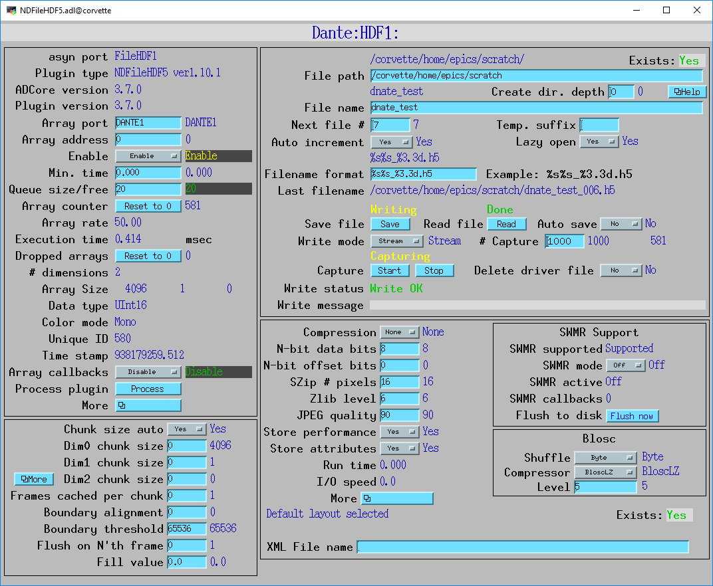

MCA mapping mode
----------------
These are the records for MCA Mapping mode.  They are contained in dante.template.

.. cssclass:: table-bordered table-striped table-hover
.. list-table::
   :header-rows: 1
   :widths: auto

   * - EPICS record names
     - Record types
     - drvInfo string
     - Description
   * - CurrentPixel
     - longin
     - DanteCurrentPixel
     - In MCA Mapping mode this is the current pixel number.  In List mode it is the total number of x-ray events received so far.
   * - MappingPoints, MappingPoints_RBV
     - longout, longin
     - DanteMappingPoints
     - The number of spectra to collect in MCA mapping mode.
     
In MCA mapping mode the GatingMode can be "Free running", "Trig rising", "Trig falling", or "Trig both".
In free-running mode the Dante will begin the next spectrum when the PresetReal time has elapsed.
In triggered mode the Dante will begin the next spectrum when a trigger occurs 
or when the PresetReal time has elapsed, whichever comes first.
To advance only on trigger events set the PresetReal time to a value larger than the maximum time between triggers.

The MCA spectra are copied into NDArrays of dimensions [NumMCAChannels, NumBoards]. For a 1-channel Dante
NumBoards is 1.  The run-time statistics for each spectrum are copied into NDAttributes attached to each
NDArray. The attribute names contain the board number, for example "RealTime_0".

The NDArrays can be used by any of the standard areaDetector plugins.  For example, they can be streamed
to HDF5, netCDF, or TIFF files.

The following is the MEDM screen NDFileHDF5.adl when the Dante is saving MCA mapping data to an HDF5 file.

