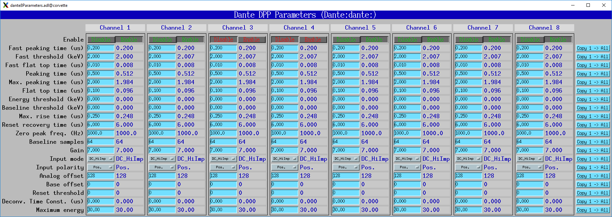
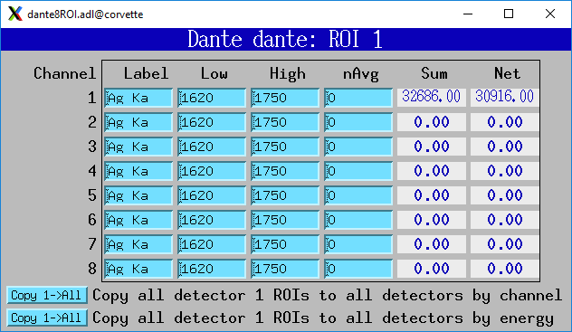

Multi-element systems
---------------------
Multi-element detector (MED) systems use an EPICS State Notation Language (SNL) program to synchronize and copy PVs.

These are the records for multi-element detector systems. They are contained in danteMED.template.

.. cssclass:: table-bordered table-striped table-hover
.. list-table::
   :header-rows: 1
   :widths: auto

   * - EPICS record names
     - Record type
     - Description
   * - SNLConnected
     - bi
     - Indicates whether or not the SNL program is running.
   * - DeadTime
     - ai
     - The average deadtime of all the enabled boards.
   * - IDeadTime
     - ai
     - The average instantaneous deadtime of all the enabled boards.
   * - Copy[XXX]
     - bo
     - Copies the setting XXX from board 0 to all other enabled boards.
       XXX can be any of the configuration parameters described above,
       for example Gain, AnalogOffset, etc.
       XXX can also be the definition of the ROIs for the MCA records.  
       In this case the copy can be either by MCA channel number, or by x-ray energy,
       using the calibration coefficients in the MCA record.
   
The following is the MEDM screen dante8Parameters.adl. This screen is used with the Dante8.

The following is the MEDM screen dante8MCA.adl. This screen is used with the Dante8.

.. figure:: dante8MCA.png
    :align: center

The following is the MEDM screen dante8Statistics.adl. This screen is used with the Dante8.

.. figure:: dante8Statistics.png
    :align: center

The following is the MEDM screen dante8ROI.adl. This screen is used with the Dante8.
It allows copying the definition of 16 ROIs from board 0 to all boards.

